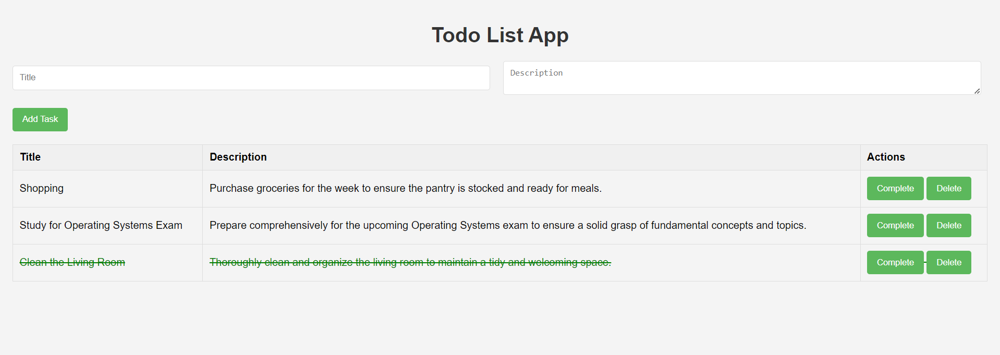

# todo-app-flask-postgresql

This is a simple web application built using Flask, a lightweight web framework in Python, and PostgreSQL, a powerful open-source relational database. The app allows users to manage their tasks with basic functionalities such as adding new tasks, marking tasks as complete, and deleting tasks. It provides a clean and intuitive interface for organizing daily tasks efficiently.



## Prerequisites
Before you begin, ensure you have met the following requirements:

- [Python](https://www.python.org/downloads/)
- [PostgreSQL](https://www.postgresql.org/download/)

## 1. Running the Application Locally

### Setting Up the Database

1. Start your PostgreSQL server.
2. Create a new PostgreSQL database for the application.
3. Update the database configuration in `app.py` to match your PostgreSQL settings:

   - DB_HOST: localhost
   - DB_USER: your PostgreSQL username
   - DB_PASSWORD: your PostgreSQL password
   - DB_DATABASE: your database name
   - DB_PORT: your database port

4. Create a table in the database that will be used by your application
   ```
   CREATE TABLE tasks (
   id SERIAL PRIMARY KEY,
   title VARCHAR(255) NOT NULL,
   description TEXT,
   is_complete BOOLEAN DEFAULT false
   );
   ```

### Running Flask App

1. Clone the repository:

   

2. Create a virtual environment:

   ```
   python3 -m venv venv
   # on Windows use `python -m venv venv`
   ```
3. Activate virtual environment:

   ```
   source venv/bin/activate
   # On Windows use `venv\Scripts\activate`
   ```

4. Install the required dependencies:

   ```
   pip3 install -r requirements.txt
   # On Windows use `pip install -r requirements.txt`
   ```

4. Start the Flask application:

   ```
   python3 app.py
   # On Windows use `python app.py`
   ```

5. Access the application at `http://localhost:5000`.


## 2. Running with Docker
1. Build the Docker image:

   ```
   docker build -t my-flask-app .
   ```

2. Run the Docker container with host network (to access the local PostgreSQL server):

   ```
   docker run --network=host my-flask-app
   ```

3. Access the application at `http://localhost:5000`.

## 3. Running App and Database with Docker compose

To run the application using docker compose:

```
docker compose up
```

This will Run both the application and the database containers and will also create a table in the database using the sql script `init.sql`

To take it down run the following command:

```
docker compose down
```

